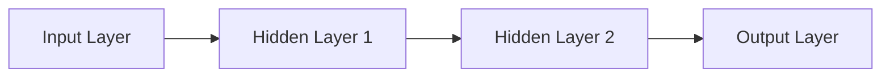
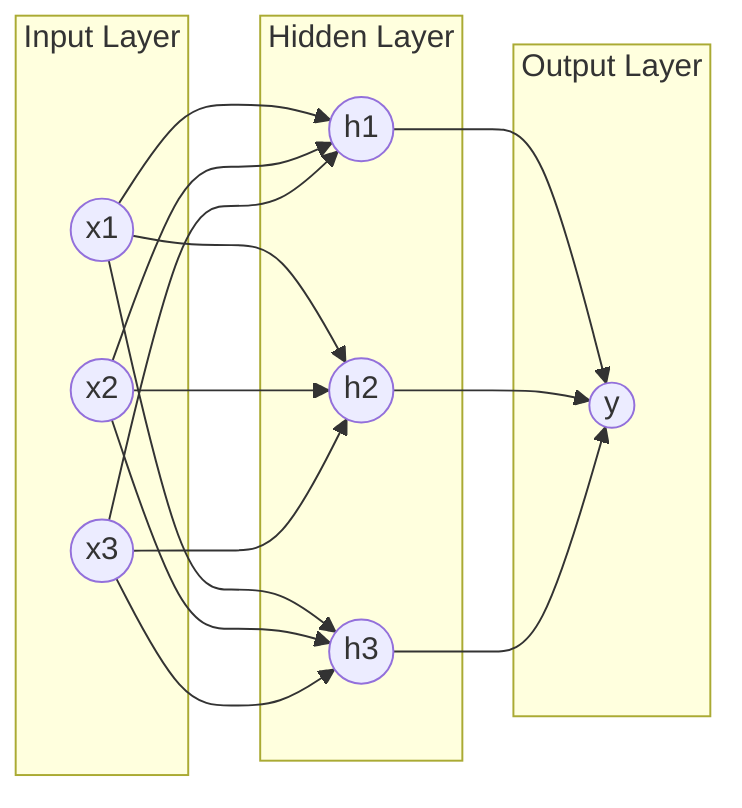
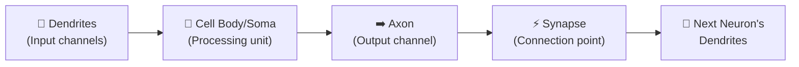
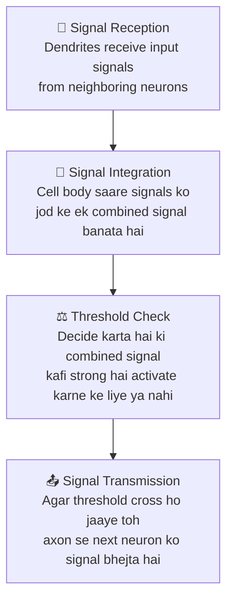
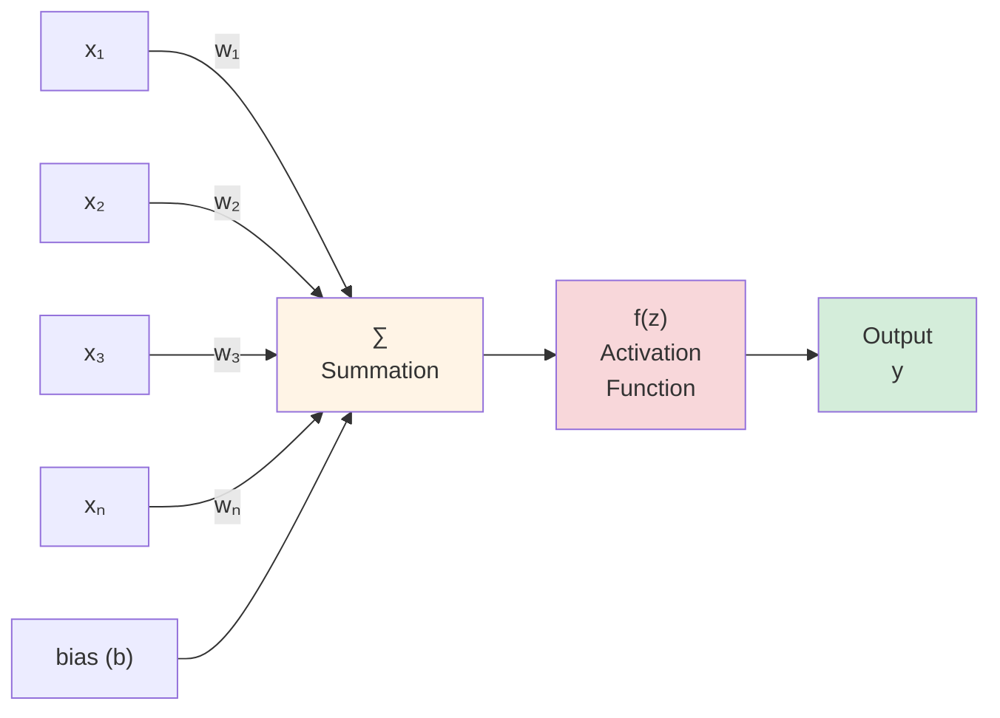
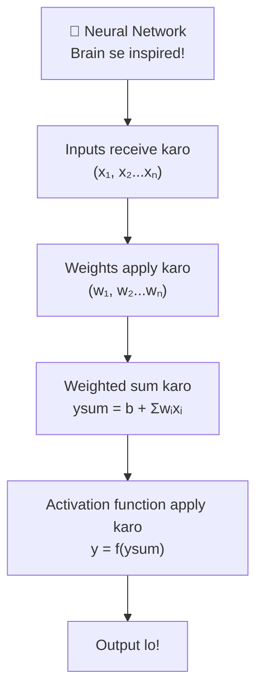

# CH-10: Basics of Neural Networks 🧠

---

## Pehle Kya Padha? — Quick Recap 

Pichle chapters mein humne padha:
- **Supervised Learning** → Classification, Regression
- **Unsupervised Learning** → Clustering, Association Rules
- **Feature Engineering** aur **Model Evaluation**

In sab methods mein ek common cheez thi — **statistical formulas aur predefined rules** pe depend karna.

---

## Problem Kya Thi? 

Real world ke bahut saare problems hote hain jo:
- 🔴 **Highly Complex** — simple formulas se solve nahi hote
- 🔴 **Non-Linear** — seedhi line se describe nahi ho sakte
- 🔴 **Pattern Intensive** — patterns bahut complex aur hidden hote hain

> **Traditional algorithms in problems mein fail ho jaate hain!**

Isliye ek naya approach develop hua — **Neural Networks** 🎉  
Jo patterns **automatically seekhte hain** — explicitly program nahi karna padta!

---

## Neural Network Kya Hota Hai? 

> **Neural Network** = Ek computational model jo **human brain se inspired** hai

- Ye ek system hai jo **interconnected units (neurons)** se bana hota hai
- Ye **patterns, relationships aur structures** data mein pehchanta hai
- Input leta hai → **Multiple hidden layers** se process karta hai → Output deta hai



---

## Types of Neural Networks

1. **Fully Connected Neural Network** — Har neuron har doosre se connected
2. **Feed Forward Neural Network** — Signal sirf aage jaata hai, peeche nahi

---

## Artificial Neural Network (ANN) 

> **ANN** = Biological neural system ka **digital/electronic simulation**

Ye artificial neurons se bana hota hai jo **3 layers** mein organized hote hain:



---

## Neural Networks Important Kyun Hain? 💡

- **Large data handle karta hai** — jitna zyada data, utna better!
- **Non-linear relationships capture karta hai** — complex patterns bhi!
- **Automatically features extract karta hai** — manually nahi batana padta
- **Experience se improve hota hai** — jitna train karo, utna accha

---

## Applications — Kahan Kahan Use Hota Hai? 

| Application | Example |
|-------------|---------|
| **Image Recognition** | Face unlock, Google Photos |
| **Speech Recognition** | Siri, Alexa, Google Assistant |
| **Natural Language Processing** | ChatGPT, Google Translate |
| **Medical Diagnosis** | Cancer detection, X-ray analysis |
| **Stock Market Prediction** | Trading bots |
| **Self-Driving Cars** | Tesla Autopilot |
| **Recommendation Systems** | Netflix, YouTube, Spotify |

---

## Human vs ML vs Neural Networks — Comparison 🆚

| Aspect | Human Learning | Traditional ML | Neural Networks |
|--------|---------------|----------------|-----------------|
| **Basis** | Experience aur Brain | Statistics aur Rules | Brain-inspired structure |
| **Adaptability** | Bahut zyada ✅ | Moderate | Bahut zyada ✅ |
| **Pattern Detection** | Natural | Limited ❌ | Strong ✅ |
| **Parallel Processing** | Haan ✅ | Nahi ❌ | Haan ✅ |

---

## Key Characteristics of Neural Networks 🔑

1. **Parallelism**: Multiple neurons simultaneously kaam karte hain — fast!
2. **Adaptability**: Weights adjust karke seekhta hai
3. **Non-linearity**: Complex, non-linear patterns handle karta hai
4. **Generalization**: Naye, unseen data pe bhi kaam karta hai
5. **Fault Tolerance**: Kuch neurons kharab ho jaayein toh bhi kaam karta hai

---

## Biological Neuron — Brain Ka Basic Unit 🧬

> ANN samajhne ke liye pehle **biological neuron** samajhna zaroori hai!

**Neuron (Nerve Cell) kya hai?**
- Human nervous system ki **fundamental unit**
- Signals **receive, process aur transmit** karta hai
- Human brain mein **billions of neurons** hain — complex networks mein connected
- Ye networks hi humein **sochne, yaad rakhne, decisions lene** aur motor functions karne dete hain!

---

## Structure of Biological Neuron 🔬

```
                    ┌─────────────────────────────────────────────────────────┐
                    │              BIOLOGICAL NEURON                          │
                    └─────────────────────────────────────────────────────────┘

      Input Signals
          │  │  │
          ▼  ▼  ▼
    ┌───────────────┐
    │  🌿 DENDRITES │◄──── Receive signals from other neurons
    │  (Branches)   │      (Input Channels)
    └───────┬───────┘
            │ Multiple signals collected
            ▼
    ┌───────────────┐
    │  🔵 CELL BODY │◄──── Processes & integrates all signals
    │    (SOMA)     │      Decides: "Fire or not?"
    │   [Nucleus]   │
    └───────┬───────┘
            │ If threshold crossed → fires!
            ▼
    ┌───────────────┐
    │   ➡️  AXON    │◄──── Long cable, carries output signal
    │  (Long Tail)  │      (Output Channel)
    └───────┬───────┘
            │
            ▼
    ┌───────────────┐
    │  ⚡ SYNAPSE   │◄──── Junction between two neurons
    │  (Gap/Joint)  │      Strength changes with learning!
    └───────┬───────┘
            │
            ▼
    Next Neuron's Dendrites  →  Signal continues...
```



### 4 Major Components:

#### 1. 🌿 Dendrites
- Branch-like extensions — **jaise tree ki branches**
- Doosre neurons se signals **receive** karte hain
- **Input channels** ki tarah kaam karte hain
- Zyada dendrites → Zyada signals receive kar sakta hai

#### 2. 🔵 Cell Body (Soma)
- Neuron ka **central processing unit**
- Incoming signals ko **process** karta hai
- Decide karta hai — **neuron activate hoga ya nahi?**
- Nucleus aur essential cellular machinery yahan hoti hai

#### 3. ➡️ Axon
- **Long, tail-like structure**
- Signal ko cell body se **door le jaata hai**
- **Output channel** ki tarah kaam karta hai
- Baaki parts se bahut lamba ho sakta hai

#### 4. ⚡ Synapse
- Do neurons ke beech ka **junction point**
- Yahan signals **transmit** hote hain
- **Synaptic strength** determine karti hai ki neurons kitne strongly connected hain
- Learning aur experience se **synaptic strength change** hoti hai — yahi learning hai!

---

## Signal Transmission Kaise Hota Hai? 



---

## Key Functional Characteristics of Biological Neuron 

### Threshold Activation
- Neuron tab hi **fire karta hai** jab input ki strength ek **limit cross** kare
- Unnecessary activation se **bachata hai** — efficient processing!

### Parallel Processing
- **Multiple neurons simultaneously** kaam karte hain
- Fast decision making enable karta hai

### Plasticity (Learning Ability)
- **Synaptic strength time ke saath change** hoti hai
- Learning hoti hai connections ko **strengthen ya weaken** karke
- Jitna practice karo, utna strong connection — isliye **repetition se yaad rehta hai!** 

---

## Artificial Neuron — ANN Ka Building Block 🤖

> Biological neuron ko **digitally simulate** karta hai

### Artificial Neuron Diagram:

```
                    ┌──────────────────────────────────────────────────────┐
                    │               ARTIFICIAL NEURON                      │
                    └──────────────────────────────────────────────────────┘

   x₁ ──[w₁]──┐
               │
   x₂ ──[w₂]──┤        ┌─────────────┐       ┌──────────────┐
               ├───────►│      Σ      │──────►│  Activation  │──────► y (Output)
   x₃ ──[w₃]──┤        │  Summation  │       │  Function    │
               │        │  Σwᵢxᵢ + b │       │   f(z)       │
   xₙ ──[wₙ]──┘        └─────────────┘       └──────────────┘
                               ▲
   b (bias) ───────────────────┘

   where:
   • xᵢ  = Input values
   • wᵢ  = Weights (importance of each input)
   • b   = Bias (threshold fine-tuning)
   • Σ   = Weighted sum: z = b + Σ(wᵢ · xᵢ)
   • f() = Activation function
   • y   = Final output
```

### Components of Artificial Neuron (Mermaid):



### Har Component Kya Karta Hai:

| Component | Biological Equivalent | Kaam |
|-----------|----------------------|------|
| **Inputs (x₁, x₂...xₙ)** | Dendrites | Data receive karo |
| **Weights (w₁, w₂...wₙ)** | Synaptic strength | Connection ki importance |
| **Summation (Σ)** | Cell body | Saare inputs add karo |
| **Bias (b)** | Activation threshold | Fine-tune karo |
| **Activation Function f(z)** | Threshold check | Fire karo ya nahi? |
| **Output (y)** | Axon signal | Result bhejo |

---

### Mathematical Formula:

**Without Bias:**
$$y_{sum} = \sum_{i=1}^{n} w_i x_i$$

**With Bias:**
$$y_{sum} = b + \sum_{i=1}^{n} w_i x_i$$

**Final Output:**
$$y = f(y_{sum})$$

### Weights Ke Types:
- ➕ **Positive Weights (Excitatory)**: Output influence **badhate** hain
- ➖ **Negative Weights (Inhibitory)**: Output influence **kam karte** hain

---

## Real Life Example — Loan Approval 🏦

> Socho ek bank decide kar raha hai ki loan approve karna hai ya nahi!

| Input (xᵢ) | Weight (wᵢ) | Meaning |
|------------|------------|---------|
| Salary | High weight (+) | Zyada salary → zyada chances |
| Credit Score | High weight (+) | Accha score → approve |
| Existing Loans | Negative weight (-) | Zyada loans → reject karne ki tendency |
| Employment Status | Medium weight (+) | Job hai toh better |

**Process:**
1. Bank ko saari details milti hain (inputs)
2. Har factor ka importance (weight) decide hota hai
3. Weighted sum calculate hota hai
4. Activation function decide karta hai — **Loan Approve ya Reject**

---

## Activation Function — Neuron Fire Kare Ya Nahi? ⚡

> **Activation Function** = Weighted sum pe ek **non-linear transformation** apply karta hai

**Kaam kya hai?**
- Decide karta hai ki neuron **"fire" karna chahiye ya nahi**
- Neural network ko **non-linear** banata hai — complex patterns seekhne mein help karta hai

$$y = f\left(b + \sum_{i=1}^{n} w_i x_i\right)$$

---

## Types of Activation Functions

### 1. Identity Function (Linear)

$$f(x) = x$$

```
Output
  |      /
  |     /
  |    /
  |   /
  |  /
  | /
  |/_________ Input
```

- **Simple linear function** — output = input
- Mainly **input layers** mein use hoti hai
- Complex patterns nahi seekh sakta
- **Analogy**: Homework copy karna bina samjhe — exact same output!

---

### 2. Threshold / Step Function

$$f(x) = \begin{cases} 1 & \text{if } x \geq 0 \\ 0 & \text{if } x < 0 \end{cases}$$

```
Output
  1 |_____________
    |
  0 |
    |_____________ Input
         0
```

- **Binary output** deta hai — ya 0 ya 1
- Early **perceptrons** mein use hota tha
- **Analogy**: Light switch — ya ON ya OFF, beech mein kuch nahi!

---

### 3. ReLU (Rectified Linear Unit)

$$f(x) = \max(0, x)$$

```
Output
  |         /
  |        /
  |       /
  |      /
  |     /
  |____/_________ Input
       0
```

- **Deep learning mein sabse zyada use hota hai!**
- Fast computation
- **Vanishing gradient problem** solve karta hai
- **Limitation — Dead Neuron Problem**: Agar value negative ho jaaye toh neuron kabhi activate nahi hota

**Analogy**: Ye wala student jo sirf positive feedback pe respond karta hai — negative milte hi shut down! 

---

### 4. Sigmoid Function 〰️

Do types hain:

#### 4.1 Binary Sigmoid

$$f(x) = \frac{1}{1 + e^{-kx}} \quad \text{(usually k=1)}$$

```
Output
  1 |          _______
    |        /
 0.5|       /
    |      /
  0 |_____/____________ Input
```

- **Output range: (0, 1)**
- **Binary classification** ke liye useful
- Output ko **probability** ki tarah interpret kar sakte hain
- Example: "70% chance hai ki email spam hai" 📧

#### 4.2 Bipolar Sigmoid

$$f(x) = \frac{1 - e^{-kx}}{1 + e^{-kx}}$$

```
Output
  1 |          _______
    |        /
  0 |-------/---------- Input
    |      /
 -1 |_____/
```

- **Output range: (-1, 1)**
- **Zero-centered** hai — matlab average output 0 ke aaspaas hai
- Binary sigmoid se **faster convergence** — jaldi seekhta hai ✅

---

## Activation Functions — Quick Comparison 📊

| Function | Formula | Range | Best For | Problem |
|----------|---------|-------|----------|---------|
| **Identity** | $f(x) = x$ | $(-\infty, +\infty)$ | Input layer | Non-linearity nahi |
| **Step** | $f(x) = 0$ or $1$ | $\{0, 1\}$ | Simple binary | Gradient = 0 |
| **ReLU** | $f(x) = \max(0,x)$ | $[0, +\infty)$ | Deep learning ✅ | Dead neurons |
| **Binary Sigmoid** | $\frac{1}{1+e^{-x}}$ | $(0, 1)$ | Binary classification | Vanishing gradient |
| **Bipolar Sigmoid** | $\frac{1-e^{-x}}{1+e^{-x}}$ | $(-1, 1)$ | Faster training | Vanishing gradient |

---

## Biological vs Artificial Neuron — Final Comparison 🔬🤖

| Biological Neuron | Artificial Neuron |
|-------------------|------------------|
| Dendrites | Input signals (x₁, x₂...xₙ) |
| Synaptic strength | Weights (w₁, w₂...wₙ) |
| Cell body (Soma) | Summation function (Σwᵢxᵢ) |
| Threshold | Bias (b) |
| Activation/Firing | Activation function f(z) |
| Axon output | Output (y) |
| Learning (plasticity) | Weight adjustment |

```
   BIOLOGICAL                          ARTIFICIAL
   ──────────                          ──────────
   
   Dendrites ──────────────────────►  Inputs (x₁, x₂...xₙ)
   
   Synaptic Strength ──────────────►  Weights (w₁, w₂...wₙ)
   
   Cell Body (Soma) ───────────────►  Summation (Σwᵢxᵢ + b)
   
   Threshold ──────────────────────►  Bias (b)
   
   Firing Decision ────────────────►  Activation Function f(z)
   
   Axon Output ────────────────────►  Output (y)
   
   Plasticity (Learning) ──────────►  Weight Adjustment (Backprop)
```

---

## Ek Baar Mein Yaad Karo — Quick Revision 🎯



> ### 💡 Ek Line Mein:
> **Neural Network** = Inputs lo → Weights se multiply karo → Sab add karo → Activation function se pass karo → Output lo!  
> Aur ye process **khud seekhta hai** ki kaunse weights sahi hain — **magic yahi hai!** 🪄

---

